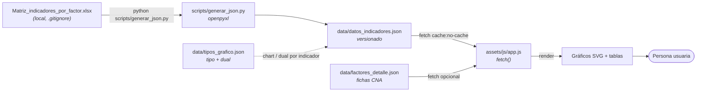
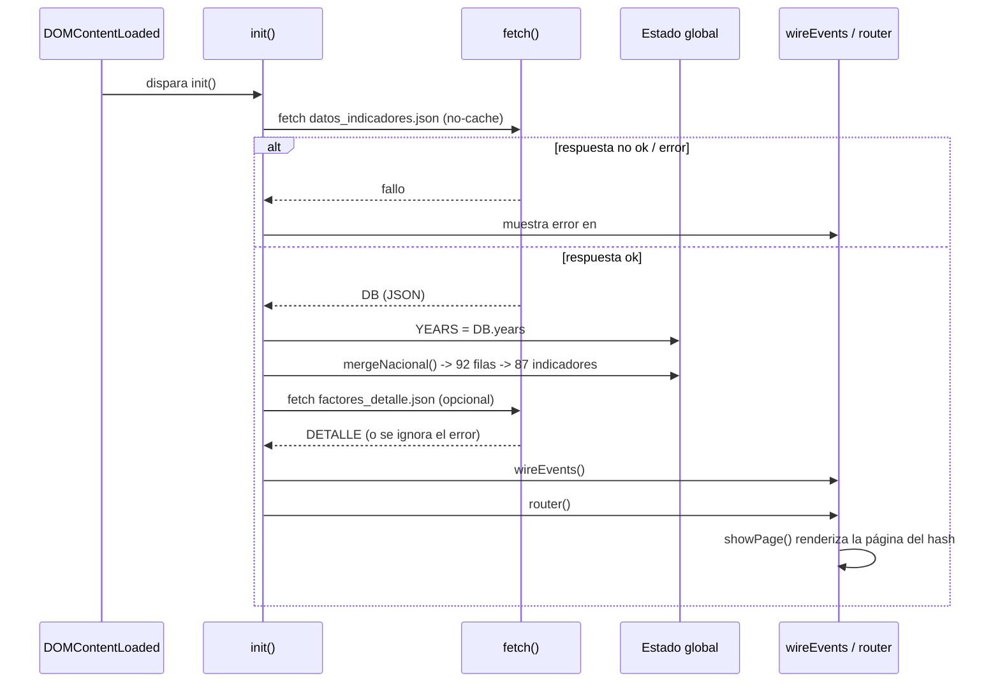
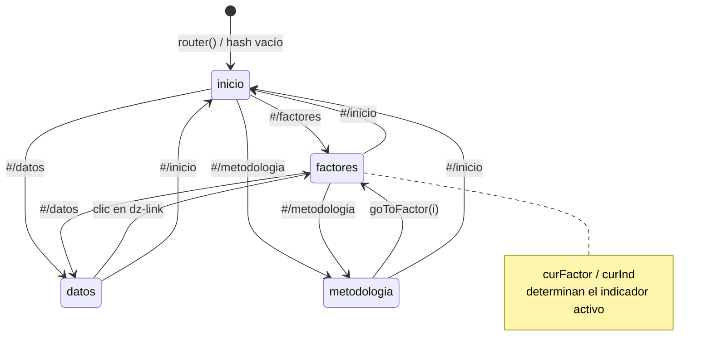
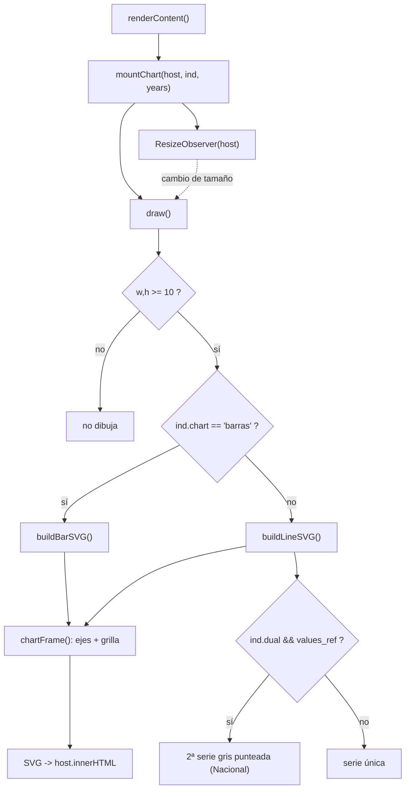

# Arquitectura — Unimagdalena en Cifras

> Documento maestro de arquitectura del tablero **Unimagdalena en Cifras**.
> Está pensado para un desarrollador que nunca ha visto el proyecto y necesita
> entenderlo de principio a fin: qué es, cómo fluyen los datos, cómo arranca la
> aplicación, cómo navega, cómo dibuja los gráficos y dónde está cada pieza.

**Documentos hermanos:** [Estilos](ESTILOS.md) · [JavaScript](JAVASCRIPT.md) · [Componentes](COMPONENTES.md) · [Sistema responsive](RESPONSIVE.md) · [Guía del desarrollador](GUIA_DESARROLLADOR.md) · [Decisiones de arquitectura (ADR)](adr/README.md) · [Publicación](PUBLICAR.md) · [CHANGELOG](../CHANGELOG.md) · [README](../README.md)

---

## 1. Visión general

**Unimagdalena en Cifras** es un tablero web **estático** que presenta los
indicadores institucionales de la Universidad del Magdalena organizados según
los **12 factores** del modelo de acreditación en alta calidad (**Acuerdo CESU
01 de 2025**), con una serie histórica **2020–2025**.

El sitio muestra, por cada indicador, su evolución de seis años mediante
gráficos SVG (líneas o barras), tarjetas de KPI (valor inicial, valor final y
tendencia) y una tabla completa descargable en JSON y CSV. Cinco indicadores
incluyen además una **línea de referencia nacional** para comparar el desempeño
de la Universidad con el promedio del país.

### Stack y filosofía

- **HTML5** semántico (una sola página, `index.html`).
- **CSS3 vanilla** con Custom Properties (design tokens en `assets/css/tokens.css`).
- **JavaScript ES6+ vanilla** (`assets/js/app.js`), sin transpilación.
- **Gráficos SVG** generados por JavaScript en tiempo de ejecución (no hay
  librería de gráficos).
- **Sin build, sin framework, sin dependencias en runtime.** No hay `npm
  install`, ni bundler, ni paso de compilación. El navegador carga el HTML, el
  CSS y un único archivo JS, y todo funciona.
- La **única dependencia** es de *tiempo de generación de datos*: la biblioteca
  Python `openpyxl`, usada por el script que convierte el Excel fuente en JSON
  (ver [`requirements.txt`](../requirements.txt)). No forma parte del sitio
  publicado.
- Tipografías **Outfit** e **Inter** cargadas desde Google Fonts (único recurso
  externo en runtime).

Esta filosofía "cero fricción" hace que el proyecto sea trivial de servir
(cualquier servidor de archivos estáticos), de auditar (todo el código es
legible tal cual se ejecuta) y de desplegar.

### Despliegue

El sitio se publica en **GitHub Pages** mediante **GitHub Actions**. El flujo de
trabajo [`.github/workflows/deploy-pages.yml`](../.github/workflows/deploy-pages.yml)
se dispara en cada `push` a `main` (o manualmente con `workflow_dispatch`), sube
la raíz del repositorio como artefacto y la despliega. El archivo `.nojekyll`
evita el procesamiento Jekyll de GitHub.

URL de producción: **https://dmetrics1.github.io/unimag-cifras/**

Para desarrollo local se requiere un servidor HTTP (el `fetch()` de los JSON no
funciona con el protocolo `file://`). Basta con:

```bash
python -m http.server 8000
```

o los scripts de conveniencia [`abrir_local.bat`](../abrir_local.bat) /
[`abrir_local.sh`](../abrir_local.sh).

---

## 2. Estructura de carpetas y archivos

Árbol de archivos **versionados** (obtenido de `git ls-files`), comentado:

```text
unimagdalena_cifras_informe/
├── index.html                      # Único documento HTML: shell, sidebar y las 4 páginas (secciones)
├── .nojekyll                       # Desactiva Jekyll en GitHub Pages
├── .gitignore                      # Excluye el Excel fuente, PDFs, venv, .claude/, etc.
├── README.md                       # Presentación y arranque rápido
├── requirements.txt                # Dependencia de generación de datos (openpyxl)
├── abrir_local.bat                 # Lanzador de servidor local (Windows)
├── abrir_local.sh                  # Lanzador de servidor local (Unix)
│
├── .github/
│   └── workflows/
│       └── deploy-pages.yml        # CI/CD: despliegue automático a GitHub Pages
│
├── assets/
│   ├── css/
│   │   └── tokens.css              # TODO el CSS: tokens, layout, componentes, responsive
│   ├── js/
│   │   └── app.js                  # TODA la lógica de la aplicación (un solo archivo)
│   └── img/
│       └── escudo-unimagdalena.png # Escudo institucional (favicon y logotipo)
│
├── data/
│   ├── datos_indicadores.json      # Datos que consume el tablero (generado desde Excel)
│   ├── factores_detalle.json       # Fichas oficiales CNA de los 12 factores (definición + características)
│   └── tipos_grafico.json          # Mapeo tipo-de-gráfico por indicador (documentación de origen)
│
├── scripts/
│   └── generar_json.py             # Pipeline Excel -> JSON (openpyxl)
│
└── docs/
    ├── ARQUITECTURA.md             # (este documento)
    ├── PUBLICAR.md                 # Guía de publicación
    └── guia.md                     # Notas de guía
```

Archivos y carpetas **locales / no versionados** (definidos en `.gitignore`),
importantes para entender el pipeline:

```text
data/Matriz_indicadores_por_factor.xlsx   # FUENTE de los datos. Local, no se sube al repo.
*.pdf                                      # Informe de autoevaluación fuente (local)
.venv/ , venv/ , __pycache__/              # Entorno Python de generación
.claude/                                   # Configuración local del editor
```

> **Clave:** el sitio publicado **no** contiene ni usa el Excel. El Excel es la
> materia prima que un editor procesa localmente con `generar_json.py` para
> producir `data/datos_indicadores.json`, que sí se versiona y sí se sirve.

---

## 3. Flujo de datos

El dato recorre cinco etapas, desde la hoja de cálculo institucional hasta el
gráfico que ve la persona usuaria:

1. **Excel fuente** — `data/Matriz_indicadores_por_factor.xlsx`, hoja
   `"Matriz Indicadores"`, con columnas `N° Factor | Factor | Indicadores | 2020
   | 2021 | 2022 | 2023 | 2024 | 2025`. Archivo local, no versionado.
2. **Generación (Python)** — `python scripts/generar_json.py` lee el Excel con
   `openpyxl` (`data_only=True`), limpia cada celda (texto/vacío → `null`),
   marca los indicadores porcentuales por palabras clave del nombre y escribe el
   JSON.
3. **JSON versionado** — `data/datos_indicadores.json`, consumido por el sitio.
   (Los tipos de gráfico y el flag `dual` se añaden a partir de
   `data/tipos_grafico.json`, mapeado desde los gráficos del Word oficial.)
4. **Carga en cliente** — `app.js` hace `fetch('data/datos_indicadores.json')`
   en el arranque, más un segundo `fetch` opcional de
   `data/factores_detalle.json`.
5. **Render** — los datos se transforman (fusión de series nacionales) y se
   dibujan como SVG en el navegador para la persona usuaria.



---

## 4. Esquemas de datos

### 4.1 `data/datos_indicadores.json`

Es la fuente de datos principal del tablero. Contiene **12 factores** y **92
filas de indicador** en total; de esas filas, **5 se llaman `"X (Nacional)"`** y
son series de referencia que se fusionan en su indicador base durante el
arranque (ver §5). Tras la fusión quedan **87 indicadores mostrados**, de los
cuales **5 tienen comparación nacional**.

Estructura general:

```json
{
  "years": [2020, 2021, 2022, 2023, 2024, 2025],
  "factors": [
    {
      "n": 1,
      "factor": "Identidad institucional",
      "indicators": [
        {
          "name": "Nivel de satisfacción con la prestación del servicio",
          "values": [0.83, 0.91, 0.89, 0.92, 0.91, 0.95],
          "pct": true,
          "chart": "barras",
          "dual": false
        }
      ]
    }
  ]
}
```

| Campo | Nivel | Tipo | Descripción |
|-------|-------|------|-------------|
| `years` | raíz | `number[]` | Años de la serie. Siempre `[2020, 2021, 2022, 2023, 2024, 2025]` (6 elementos). Se asigna a la global `YEARS`. |
| `factors` | raíz | `object[]` | Los 12 factores, ordenados por `n`. |
| `n` | factor | `number` | Número de factor (1–12). |
| `factor` | factor | `string` | Nombre completo oficial del factor. |
| `indicators` | factor | `object[]` | Indicadores del factor. |
| `name` | indicador | `string` | Nombre del indicador. Si termina en `" (Nacional)"` es una serie de referencia que se fusiona. |
| `values` | indicador | `(number \| null)[]` | 6 valores, uno por año. `null` = dato no disponible / no aplica (la serie salta ese año). |
| `pct` | indicador | `boolean` | `true` si el valor es una proporción (0–1) que se muestra como porcentaje. |
| `chart` | indicador | `"barras" \| "linea"` | Tipo de gráfico a dibujar. |
| `dual` | indicador | `boolean` | `true` si el indicador tiene una segunda serie de comparación (nacional). |

Campo añadido **en tiempo de ejecución** (no está en el archivo, lo crea
`mergeNacional()`):

| Campo | Nivel | Tipo | Descripción |
|-------|-------|------|-------------|
| `values_ref` | indicador | `(number \| null)[]` | 6 valores de la serie nacional de referencia, copiados de la fila `"X (Nacional)"` al fusionarla en su indicador base. |

> Notas de formato: los valores porcentuales se almacenan como fracción
> (`0.83` = 83 %). Algunos valores llevan más decimales de los que se muestran
> (p. ej. `24019.230705`); el formateo lo resuelve la función `fmt()` en el
> cliente.

### 4.2 `data/factores_detalle.json`

Contiene la ficha oficial de cada factor según los **Lineamientos del CNA**
(usada por el modal grande de la página Metodología). Es de carga **opcional**:
si falla el `fetch`, el tablero sigue funcionando con textos de respaldo.

```json
{
  "fuente": "CNA · Lineamientos para la Acreditación Institucional en Alta Calidad (Capítulo 3, articles-426854)",
  "factores": [
    {
      "n": 1,
      "nombre": "Identidad institucional",
      "definicion": "Una institución de alta calidad tiene unos valores declarados...",
      "caracteristicas": [
        {
          "n": 1,
          "titulo": "Demostración de la coherencia, pertinencia y relevancia de la misión...",
          "descripcion": "La institución cuenta con una misión que es pertinente...",
          "aspectos": [
            "Evalúa que sus resultados e impactos son coherentes con su misión..."
          ]
        }
      ]
    }
  ]
}
```

| Campo | Nivel | Tipo | Descripción |
|-------|-------|------|-------------|
| `fuente` | raíz | `string` | Cita de la fuente documental (Lineamientos CNA, `articles-426854`). |
| `factores` | raíz | `object[]` | Fichas de los 12 factores. |
| `n` | factor | `number` | Número de factor (1–12). Se usa como clave en el objeto `DETALLE`. |
| `nombre` | factor | `string` | Nombre del factor. |
| `definicion` | factor | `string` | Definición oficial del factor. |
| `caracteristicas` | factor | `object[]` | Características de alta calidad del factor. |
| `n` | característica | `number` | Número de característica (numeración continua entre factores). |
| `titulo` | característica | `string` | Título de la característica. |
| `descripcion` | característica | `string` | Párrafo descriptivo. |
| `aspectos` | característica | `string[]` | Aspectos a evaluar de la característica. |

### 4.3 `data/tipos_grafico.json`

Documenta, por indicador, el tipo de gráfico (`chart`) y el flag `dual`,
mapeados por coincidencia de valores contra los gráficos embebidos en el Word
oficial del informe de reacreditación. Es material de **procedencia /
documentación**: no lo consume `app.js` en runtime (los campos ya están
integrados en `datos_indicadores.json`). Sus contadores registran `92` filas
totales y `87` mapeadas.

---

## 5. Ciclo de vida de la aplicación (`init()`)

Todo el arranque cuelga de un único listener:

```js
document.addEventListener('DOMContentLoaded', init);
```

`init()` (función `async`) ejecuta, en orden:

1. **`fetch('data/datos_indicadores.json', {cache:'no-cache'})`** — carga los
   datos. Si la respuesta no es `ok` o falla, muestra un mensaje de error en
   `#content` (recordando servir el sitio por HTTP) y **aborta** el arranque.
2. **`YEARS = DB.years`** — publica el arreglo de años en la global `YEARS`.
3. **`mergeNacional()`** — recorre cada factor y fusiona cada fila cuyo nombre
   coincide con el patrón `^(.+?)\s*\(Nacional\)\s*$` dentro de su indicador
   base: copia sus valores a `base.values_ref`, pone `base.dual = true` y
   `base.chart = 'linea'`, y **elimina** la fila nacional del arreglo. Resultado:
   de 92 filas se pasa a **87 indicadores mostrados**, 5 de ellos con
   comparación nacional.
4. **`fetch('data/factores_detalle.json', {cache:'no-cache'})`** — carga
   opcional; si responde `ok`, vuelca cada factor en el objeto global `DETALLE`
   indexado por `n`. Cualquier error se ignora (el detalle es opcional).
5. **`wireEvents()`** — conecta todos los manejadores de eventos globales
   (navegación, menú móvil, sidebar colapsable, teclado `Escape`) e instancia
   los dropdowns de la barra de filtros (`ddFactor`, `ddInd`).
6. **`router()`** — lee `location.hash` y renderiza la página inicial.



**Estado global** (variables de módulo en `app.js`): `DB` (datos), `DETALLE`
(fichas de factor), `YEARS` (años), `curFactor` / `curInd` (índices activos en
la página Factores), `curPage` (página activa), `ddFactor` / `ddInd`
(instancias de dropdown), `datosQuery` / `datosFactor` (filtros de la página
Datos). Constantes de color: `ACCENT` (`#0183EF`, serie Unimagdalena), `GOLD`
(`#FF9400`, punto final) y `NACIONAL` (`#8295AB`, serie de referencia).

---

## 6. Sistema de navegación

La navegación es **hash routing** puro, sin recarga de página. Las cuatro
páginas (`inicio`, `factores`, `metodologia`, `datos`) existen como secciones
`.page` en el HTML; solo una tiene la clase `.is-active` a la vez.

- **`router()`** — se ejecuta al arrancar y en cada `hashchange`. Normaliza
  `location.hash` (quita el prefijo `#/`) y llama a `showPage(hash || 'inicio')`.
- **`showPage(page)`** — valida contra el arreglo `PAGES`
  (`['inicio','factores','metodologia','datos']`; si no coincide, cae a
  `inicio`), actualiza `curPage`, alterna la clase `.is-active` sobre la sección
  `#page-<page>` y marca el botón correspondiente en `#pageNav`. Luego cierra el
  menú móvil, invoca el render de la página (`renderInicio` / `renderFactores` /
  `renderMetodologia` / `renderDatos`) y hace scroll al tope.
- Los botones de navegación (`#pageNav .nav__item`) no llaman directamente al
  render: solo cambian `location.hash = '/' + page`, lo que dispara
  `hashchange → router → showPage`. Así, enlaces, botones e historial del
  navegador quedan sincronizados con una única fuente de verdad (el hash).

Rutas: `#/inicio`, `#/factores`, `#/metodologia`, `#/datos`.



Transiciones cruzadas notables: desde **Metodología**, `goToFactor(i)` fija
`curFactor` y salta a `#/factores`; desde **Datos**, cada enlace `.dz-link` de
la tabla fija `curFactor`/`curInd` y salta a `#/factores`; desde **Inicio**, los
botones del hero saltan a `#/factores` o `#/metodologia`.

---

## 7. Renderizado por página

Cada página tiene una función `render*` que reconstruye su HTML dentro de un
contenedor propio. Se invocan desde `showPage()`.

- **`renderInicio()`** → contenedor `#inicioContent`. Dibuja el *hero*
  (título, subtítulo, dos botones de acción) y tres *tiles* de resumen: número
  de factores (`DB.factors.length`), total de indicadores (suma de
  `indicators.length` de todos los factores) y periodo (`YEARS.length` años).
  Los botones enlazan a `#/factores` y `#/metodologia`.

- **`renderFactores()`** → banda superior (`#fEyebrow`, `#fTitle`, `#fSub`) +
  contenido. Toma el factor activo (`currentFactor()`), rellena la banda,
  alimenta los dropdowns `ddFactor` (lista de los 12 factores) y `ddInd`
  (indicadores del factor) y delega en `renderContent()`. Esta última dibuja el
  bloque del indicador activo (`currentInd()`): cabecera con leyenda (si es
  `dual`), el `#chartHost` para el gráfico y dos tarjetas KPI (valor final con
  tendencia y valor inicial). Al final llama a `mountChart(...)`.

- **`renderMetodologia()`** → contenedor `#metodologiaContent`. Genera una
  rejilla de 12 tarjetas `.pt-card` (una por factor, con ícono, número, nombre
  corto y conteo de indicadores) más el overlay y el panel modal
  (`#ptOverlay`, `#ptPanel`). Cada tarjeta abre `openFactorPanel(i)`.

- **`renderDatos()`** → contenedor `#datosContent`. Aplana todos los
  indicadores a filas, aplica los filtros de búsqueda (`datosQuery`) y de factor
  (`datosFactor`), y arma la tabla completa con cabecera de años. Incluye la
  descarga JSON (enlace directo) y CSV (`downloadCSV()`), un buscador y un
  dropdown de factor. Cada nombre de indicador es un botón `.dz-link` que salta
  a la página Factores en ese indicador. La búsqueda re-renderiza en cada
  pulsación preservando el foco y la posición del cursor.

Los datos de presentación de cada factor (color, ícono, nombre corto y
descripción) viven en el arreglo constante `FACTORES_INFO` dentro de `app.js`;
los íconos SVG en el diccionario `ICO`.

---

## 8. Motor de gráficos

Los gráficos son **SVG generados por JavaScript**, responsivos al tamaño real
de su contenedor.

- **`mountChart(host, ind, years)`** — punto de entrada. Define una función
  `draw()` que lee `host.clientWidth`/`clientHeight`, elige el constructor según
  `ind.chart` (`'barras'` → `buildBarSVG`, cualquier otro valor → `buildLineSVG`)
  e inyecta el SVG resultante en `host.innerHTML`. Dibuja una vez y luego
  registra un **`ResizeObserver`** (global `chartRO`, que se desconecta antes de
  crear uno nuevo) sobre `host`: cada cambio de tamaño redibuja el SVG con las
  dimensiones actuales. Así los gráficos se adaptan con precisión a la columna
  disponible sin depender de media queries.

- **`chartFrame(w, h, mn, mx, pct, pad)`** — helper compartido de ejes. Calcula
  la función de escala vertical `Y(v)` y construye la grilla horizontal (5
  líneas) con sus etiquetas de valor en el eje Y (formateadas con `fmt`). El
  tamaño de fuente se reduce cuando `w < 420` (adaptación a móvil).

- **`buildLineSVG(ind, years, w, h)`** — gráfico de línea. Filtra los puntos no
  nulos, calcula el dominio con un margen del 12 %, dibuja el área con degradado,
  la línea principal (color `ACCENT`), los puntos con su valor, resalta el punto
  final (color `GOLD`) y rotula los años en el eje X. Si el indicador es `dual`
  y tiene `values_ref`, dibuja además la **segunda serie** (nacional) como línea
  **gris punteada** (`stroke-dasharray`, color `NACIONAL`) con puntos huecos.

- **`buildBarSVG(ind, years, w, h)`** — gráfico de barras. Calcula el ancho de
  barra en función del espacio, dibuja una barra por año (la última en tono más
  oscuro `#004A87`) con su valor encima y rotula los años. No dibuja segunda
  serie.

Además existen dos generadores SVG **independientes del motor responsivo**,
usados en contextos de tamaño fijo: `sparkline(...)` (mini-gráfico de tarjeta) y
`bigChart(...)` (gráfico grande de detalle).



---

## 9. Componentes reutilizables

`app.js` define varios componentes de interfaz reutilizados entre páginas
(detalle completo en [COMPONENTES.md](COMPONENTES.md)):

- **`makeDropdown(root, labelId, onSelect)`** — dropdown personalizado y
  accesible (clases `.dd`, roles `listbox`/`option`, navegación por teclado).
  Se usa en la barra de filtros de Factores y en el filtro de la página Datos.
- **`openFactorPanel(i)` / `closeFactorPanel()`** — modal grande de factor
  (clase `.fdlg`) que muestra la ficha oficial (definición y características)
  desde `DETALLE`, con botón para saltar a los indicadores del factor.
- **Tarjetas de factor `.pt-card`** — rejilla de la página Metodología.
- **KPIs `.fx-kpi`** — tarjetas de valor inicial / final con tendencia.

---

## 10. Sistema responsive

La adaptación a distintos tamaños vive por completo en
[`assets/css/tokens.css`](../assets/css/tokens.css) (design tokens, escala
fluida con `clamp()`, media queries) más el redibujado por `ResizeObserver` de
los gráficos. Existe un encabezado móvil (`.mobile-header`) y un menú lateral
tipo *drawer* con overlay para pantallas menores a 920 px, y un sidebar
colapsable en escritorio (estado persistido en `localStorage`, clave
`sbCollapsed`). El detalle de breakpoints y la regla "sin scroll" se documenta
en [RESPONSIVE.md](RESPONSIVE.md).
```

