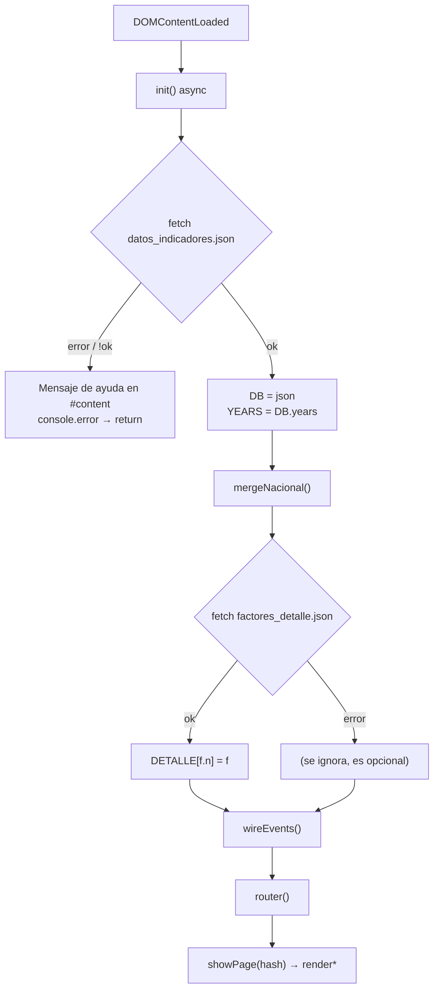

# Capa JavaScript — `assets/js/app.js`

Documentación técnica de la lógica de cliente del tablero **Unimagdalena en Cifras**.
Dirigida a una persona desarrolladora que llega nueva al proyecto y necesita entender,
mantener y extender el código sin sorpresas.

> Fuente: `assets/js/app.js` (739 líneas, un solo archivo). Todo lo descrito aquí
> corresponde a funciones reales presentes en ese archivo, con sus firmas exactas.

Enlaces relacionados:
- [Arquitectura general](ARQUITECTURA.md)
- [Componentes de UI](COMPONENTES.md)
- [Estilos y tokens](ESTILOS.md)
- [Guía del desarrollador](GUIA_DESARROLLADOR.md)

---

## 1. Visión general

`app.js` es **un único archivo** de JavaScript plano (ES2017+, `async/await` y
`ResizeObserver`), servido directamente por el navegador. Sus características de diseño:

- **Sin build**: no hay bundler, transpilador ni paso de compilación. Se edita el
  archivo y se recarga la página.
- **Sin módulos ES**: no hay `import`/`export`. No es siquiera un IIFE — todas las
  funciones y constantes viven en el **ámbito global** (`window`). Esto es deliberado:
  varias funciones se invocan desde atributos `onclick` incrustados en el HTML que se
  genera dinámicamente (por ejemplo `onclick="closeFactorPanel()"` en
  `openFactorPanel`), lo que exige que sean accesibles globalmente.
- **Sin dependencias**: cero librerías externas. Los gráficos son SVG construido a mano
  como strings, el enrutado usa el `hash` de la URL, y el formato numérico usa
  `Intl`/`toLocaleString` nativo.
- **Patrón "render por estado"**: no hay framework reactivo ni Virtual DOM. El estado
  vive en unas pocas variables globales `let`. Para actualizar la interfaz se sigue
  siempre el mismo ciclo: **mutar el estado → llamar a la función `render*` de la
  página → esta reescribe `innerHTML` del contenedor**. No hay data-binding automático;
  el re-render es explícito.

Consecuencia práctica: si tocas el estado y la pantalla no cambia, es porque olvidaste
llamar al `render*` correspondiente. Ese es el modelo mental central del archivo.

---

## 2. Estado global

Constantes de color (líneas 12–14):

| Constante | Valor | Uso |
|-----------|-------|-----|
| `ACCENT` | `#0183EF` | Serie de datos principal (azul institucional): líneas, barras, áreas. |
| `GOLD` | `#FF9400` | Punto final resaltado de la serie / referencia visual. |
| `NACIONAL` | `#8295AB` | Serie de referencia "Nacional" (línea gris punteada en gráficos duales). |

Variables de estado mutable (`let`):

| Variable | Inicial | Propósito |
|----------|---------|-----------|
| `DB` | `null` | Objeto de datos completo cargado de `datos_indicadores.json`. Contiene `DB.years` y `DB.factors[]`. |
| `DETALLE` | `{}` | Detalle oficial CNA por número de factor (`{definicion, caracteristicas[]}`), indexado por `f.n`. Cargado de `factores_detalle.json`. Opcional. |
| `YEARS` | `[]` | Array de años de la serie (copiado de `DB.years`). Eje X compartido por todos los gráficos y tablas. |
| `curFactor` | `0` | Índice del factor activo dentro de `DB.factors`. |
| `curInd` | `0` | Índice del indicador activo dentro del factor actual. |
| `PAGES` | `['inicio','factores','metodologia','datos']` | Lista blanca de páginas válidas (const). |
| `curPage` | `'inicio'` | Página actualmente visible. |
| `ddFactor` | `null` | Instancia del dropdown de factores (creada por `makeDropdown`). |
| `ddInd` | `null` | Instancia del dropdown de indicadores. |
| `chartRO` | `null` | `ResizeObserver` único y reutilizado para redibujar el gráfico activo. |
| `datosQuery` | `''` | Texto del buscador de la página Datos. |
| `datosFactor` | `-1` | Filtro por factor en la página Datos (`-1` = todos). |

Todas son globales. No hay encapsulación por diseño (ver sección 1).

---

## 3. Ciclo de arranque `init()`

`init()` es `async` y se dispara una sola vez en `DOMContentLoaded` (línea 739). Pasos:

1. **Fetch de datos principales**: `fetch('data/datos_indicadores.json', {cache:'no-cache'})`.
   El `no-cache` fuerza revalidación para que los datos actualizados se vean sin vaciar
   la caché del navegador.
2. **Manejo de error**: si la respuesta no es `ok` (o falla la red), escribe un mensaje
   de ayuda dentro de `#content` (sugiere levantar un servidor local con
   `python -m http.server 8000`), hace `console.error` y **retorna** (aborta el
   arranque). Este es el caso típico al abrir el HTML con `file://`.
3. **`YEARS = DB.years`**: fija el eje temporal global.
4. **`mergeNacional()`**: fusiona los pares de indicadores "X" / "X (Nacional)" en una
   sola serie dual (ver sección 9).
5. **Fetch de detalle CNA** (opcional): `factores_detalle.json`. Si carga bien, vuelca
   cada factor en `DETALLE[f.n]`. Si falla, se ignora silenciosamente (el detalle es
   prescindible; solo enriquece el modal de metodología).
6. **`wireEvents()`**: cablea todos los listeners globales y crea los dos dropdowns de
   la barra de filtros (ver sección 10).
7. **`router()`**: lee el `hash` actual y pinta la página correspondiente.



---

## 4. Navegación

El enrutado se basa en el **hash de la URL** (`#/factores`, `#/datos`, …). No hay
History API ni servidor de rutas: es apto para hosting estático (GitHub Pages).

| Función | Propósito | Parámetros |
|---------|-----------|------------|
| `showPage(page)` | Activa una página: valida contra `PAGES` (si no existe → `'inicio'`), aplica `.is-active` a la `.page` y al botón de nav correspondientes, cierra el menú móvil, invoca el `render*` de la página y hace scroll al tope. | `page: string` |
| `router()` | Lee `location.hash`, le quita el prefijo `#/`, y llama a `showPage(h || 'inicio')`. | — |

`router()` se registra como listener de `hashchange` en `wireEvents`. Los botones de
navegación **no llaman a `showPage` directamente**: cambian `location.hash`
(`location.hash = '/' + b.dataset.page`), lo que dispara `hashchange` → `router` →
`showPage`. Un único camino, sin estados divergentes. Lo mismo hacen los enlaces
cruzados internos (`goToFactor`, botones de la tabla de Datos, hero de inicio).

`showPage` despacha al render según la página:

```js
if(page === 'factores')      renderFactores();
else if(page === 'inicio')   renderInicio();
else if(page === 'datos')    renderDatos();
else if(page === 'metodologia') renderMetodologia();
```

---

## 5. Sistema de render

Regla invariable: **una función `render*` por página**, y cada una es responsable de
escribir el `innerHTML` de su contenedor. El patrón de actualización es siempre
**cambiar estado → llamar al render**.

| Función | Contenedor | Qué pinta |
|---------|-----------|-----------|
| `renderInicio()` | `#inicioContent` | Hero (título, subtítulo, descripción, 2 botones) + 3 *tiles* de resumen (nº factores, nº indicadores, periodo). Cablea los botones a `location.hash`. |
| `renderFactores()` | banda + `#content` | Actualiza la banda oscura (eyebrow, título, subtítulo del factor), llena los dropdowns `ddFactor`/`ddInd` y delega en `renderContent()`. Corrige `curInd` si se salió de rango. |
| `renderContent()` | `#content` | Cabecera del indicador (título + leyenda si es dual), *host* del gráfico, y 2 KPIs (valor final con delta de tendencia, valor inicial). Al final llama a `mountChart`. |
| `renderMetodologia()` | `#metodologiaContent` | Hero + grilla de 12 tarjetas (una por factor) + el overlay y el panel del modal. Cablea cada tarjeta a `openFactorPanel`. |
| `renderDatos()` | `#datosContent` | Cabecera con descargas (JSON/CSV) + controles (buscador + dropdown de factor) + tabla completa + contador. Cablea input, dropdown, botón CSV y enlaces de fila. |

Ejemplos del patrón "estado → render" tomados del código real:

- Al elegir factor en el dropdown: `curFactor=i; curInd=0; renderFactores();`
- Al elegir indicador: `curInd=i; renderContent();`
- Al escribir en el buscador de Datos: `datosQuery=e.target.value; … renderDatos();`
- Al filtrar por factor en Datos: `datosFactor=sel-1; renderDatos();`

Nota sobre el buscador: como `renderDatos()` reescribe todo el `innerHTML`, el `<input>`
se destruye y recrea en cada tecla. Por eso el handler guarda la posición del cursor
(`selectionStart`), re-renderiza, y luego restaura foco + `setSelectionRange` sobre el
nuevo input. Es una peculiaridad esperable del patrón de re-render total.

---

## 6. Motor de gráficos

Los gráficos son **SVG generado como string** e inyectado en un contenedor. No hay
canvas ni librería.

### `mountChart(host, ind, years)`

Punto de entrada. Parámetros: `host` (elemento contenedor, típicamente `#chartHost`),
`ind` (objeto indicador), `years` (array de años).

- Define un closure `draw()` que mide `host.clientWidth`/`clientHeight`, y si el tamaño
  es válido (≥10px) reescribe `host.innerHTML` con barras o línea según `ind.chart`
  (`'barras'` → `buildBarSVG`, cualquier otro valor → `buildLineSVG`).
- Dibuja una vez inmediatamente.
- **Patrón ResizeObserver**: desconecta el observer anterior (`chartRO.disconnect()`) y
  crea uno nuevo que llama a `draw` en cada cambio de tamaño, observando `host`.

**Por qué un `ResizeObserver` (y por qué uno solo).** El SVG se genera con dimensiones
en píxeles calculadas a partir del tamaño real del contenedor, de modo que los ejes,
las etiquetas y el grosor de trazo se ven nítidos y adaptados (incluso ajusta tamaños de
fuente y *paddings* cuando `w < 420`, para móvil). Un SVG con `viewBox` fijo y escalado
por CSS se vería borroso o con etiquetas deformadas. El observer redibuja al vuelo
cuando la ventana cambia, se colapsa el sidebar, etc. Se mantiene **una única instancia**
en `chartRO` porque en pantalla solo hay un gráfico activo a la vez (el de la página
Factores); al montar uno nuevo se descarta el anterior para no acumular observers
huérfanos que sigan disparando sobre nodos viejos.

### `chartFrame(w, h, mn, mx, pct, pad)`

Helper compartido por línea y barras. Calcula la función de proyección vertical
`Y(v)` y genera la **grilla horizontal** (4 divisiones) con sus etiquetas del eje Y
formateadas por `fmt`. Devuelve `{Y, grid}`. Centraliza la lógica de ejes para que ambos
tipos de gráfico luzcan consistentes.

### `buildLineSVG(ind, years, w, h)`

Gráfico de línea con área bajo la curva.

- Filtra nulos; si hay menos de 2 puntos válidos devuelve un aviso "Datos insuficientes".
- Calcula min/max con un *padding* vertical del 12% para que la línea no toque los bordes.
- Dibuja: área con gradiente, línea principal (`ACCENT`), puntos blancos con etiqueta de
  valor sobre cada uno, y un punto final resaltado en `GOLD`.
- **Serie dual**: si `ind.dual` y existe `ind.values_ref` (array), dibuja además una
  **segunda serie gris punteada** (`NACIONAL`, `stroke-dasharray="5 4"`) con sus propios
  puntos. El rango del eje se calcula considerando ambas series.
- Etiquetas del eje X = `years`.

### `buildBarSVG(ind, years, w, h)`

Gráfico de columnas.

- Filtra nulos; si no hay puntos devuelve "Sin datos para graficar".
- Base siempre en 0 (`mn = Math.min(0, …)`), máximo con 12% de holgura.
- Ancho de barra = `min(slot*0.55, 48)`. La **última columna se resalta** en `#004A87`
  (más oscuro) frente al `ACCENT` de las demás. Etiqueta de valor encima de cada barra.

Tabla resumen:

| Función | Propósito | Parámetros |
|---------|-----------|------------|
| `mountChart` | Monta el gráfico y engancha el redibujado responsivo. | `host, ind, years` |
| `chartFrame` | Proyección Y + grilla/etiquetas del eje Y. | `w, h, mn, mx, pct, pad` |
| `buildLineSVG` | SVG de línea + área (+ 2ª serie si dual). | `ind, years, w, h` |
| `buildBarSVG` | SVG de barras, última resaltada, base en 0. | `ind, years, w, h` |

---

## 7. Componente dropdown reutilizable — `makeDropdown`

Selector accesible construido a mano (no es un `<select>` nativo) para poder estilizarlo
por completo. Se usa en la barra de filtros de Factores (2 instancias) y en el filtro de
la página Datos (1 instancia).

**Firma**: `makeDropdown(root, labelId, onSelect)`

| Parámetro | Significado |
|-----------|-------------|
| `root` | Elemento contenedor donde se inyecta el botón + menú. |
| `labelId` | `id` del label asociado (para `aria-labelledby`). |
| `onSelect` | Callback `(indice) => void` que se dispara al elegir una opción. |

**API devuelta** (objeto):

| Método | Propósito |
|--------|-----------|
| `setItems(newItems, sel)` | Reemplaza las opciones (`string[]`) y fija la seleccionada (índice, acotado al rango). Repinta valor y menú. |
| `close()` | Cierra el menú programáticamente. |

**Accesibilidad y comportamiento** implementados en el closure interno:

- Roles ARIA: botón con `aria-haspopup="listbox"` / `aria-expanded`; menú con
  `role="listbox"`; opciones con `role="option"` y `aria-selected`.
- **Teclado**: `↓`/`↑` abren el menú o mueven el índice activo (con `scrollIntoView`);
  `Enter`/`Espacio` abren o confirman la opción activa; `Esc` cierra.
- **Clic fuera**: registra `mousedown`/`touchstart` en `document` (fase de captura)
  para cerrar al tocar fuera de `root`; los desregistra al cerrar.
- **Volteo**: si el menú se saldría por la derecha de la ventana, cambia de anclaje
  `left`→`right`.
- **Tooltip**: `title` en el botón y en cada opción con el texto completo (útil cuando
  se trunca).
- **Sanitización**: los textos de opción pasan por `escHtml` antes de inyectarse.

---

## 8. Modal de factor y menú móvil

### Modal de factor (página Metodología)

| Función | Propósito | Parámetros |
|---------|-----------|------------|
| `openFactorPanel(i)` | Abre el modal grande `.fdlg`. Compone: cabecera (ícono + eyebrow + título corto), texto completo del factor, definición e introducción desde `DETALLE[f.n]` (o `f.desc` como respaldo), y las "Características de alta calidad" (numeradas, con descripción y aspectos). Aplica el color del factor vía `--fc`, muestra overlay `#ptOverlay`, añade `body.no-scroll`. El CTA del pie salta a los indicadores con `goToFactor(i)`. | `i: número (índice de factor)` |
| `closeFactorPanel()` | Oculta panel y overlay, restaura scroll del body. | — |

Datos que consume: `FACTORES_INFO[i]` (metadatos visuales) + `DB.factors[i]`
(nombre/conteo) + `DETALLE[f.n]` (definición y características oficiales CNA).

### Menú móvil (drawer)

El sidebar se convierte en un panel deslizante en móvil, con overlay.

| Función | Propósito |
|---------|-----------|
| `openMobileMenu()` | Añade `.is-open` a `#sidebar`, `.is-active` a `#sbOverlay`, `aria-expanded=true` al botón `#mbMenuBtn`, y `body.no-scroll`. |
| `closeMobileMenu()` | Revierte lo anterior (`aria-expanded=false`). |
| `toggleMobileMenu()` | Alterna según si `#sidebar` tiene `.is-open`. |

`showPage` llama a `closeMobileMenu()` en cada navegación, para que el drawer se cierre
solo al elegir una página.

### Modal legado `closeModal()`

Existe `closeModal()` (oculta `#overlay`, quita `no-scroll`), cableada en `wireEvents` y
en el `Escape` global. Corresponde a un overlay `#overlay` heredado; el modal en uso hoy
es el de factor (`#ptPanel`/`#ptOverlay`). Se conserva por compatibilidad y es inofensiva.

---

## 9. Helpers de datos

| Función | Propósito | Parámetros / Retorno |
|---------|-----------|----------------------|
| `fmt(v, pct)` | Formatea un valor para mostrar. `null`/`undefined` → `'—'`. Si `pct`, multiplica por 100 y añade `%` (sin decimal `.0` sobrante). Miles con separador `es-CO`. Enteros tal cual; resto con 2 decimales máx. | `v: number\|null`, `pct: boolean` → `string` |
| `lastVal(a)` | Último valor no nulo del array y su índice. | `a: array` → `{v, i}` (o `{v:null,i:-1}`) |
| `firstVal(a)` | Primer valor no nulo del array y su índice. | `a: array` → `{v, i}` |
| `trend(vals)` | Dirección y variación porcentual entre el primer y el último valor no nulos. Umbral ±0.5% para clasificar. | `vals: array` → `{dir:'up'\|'down'\|'flat', pct:number}` |
| `escHtml(s)` | Escapa `& < > "` para inyección segura en `innerHTML`. | `s` → `string` |
| `mergeNacional()` | Recorre cada factor y fusiona pares "X" / "X (Nacional)": mueve los valores del gemelo "(Nacional)" a `base.values_ref`, marca `base.dual=true` y fuerza `base.chart='linea'`, y elimina el indicador "(Nacional)" suelto de la lista. | — (muta `DB`) |

`trend` alimenta el KPI "Valor final": el signo, la flecha (▲/▼/▬) y la clase de color
(`up`/`down`/`flat`) salen de su `dir`/`pct`. `mergeNacional` es lo que habilita los
gráficos duales de la sección 6: sin él, "Cobertura" y "Cobertura (Nacional)" serían dos
indicadores separados en lugar de dos series del mismo gráfico.

---

## 10. Eventos y listeners

Casi todo el cableado vive en `wireEvents()` (llamada una vez desde `init`):

| Enganche | Acción |
|----------|--------|
| `#pageNav .nav__item` (click) | `location.hash = '/' + dataset.page` (→ router). |
| `window` `hashchange` | `router` (navegación por hash). |
| `#mbMenuBtn` (click) | `toggleMobileMenu`. |
| `#sbOverlay` (click) | `closeMobileMenu`. |
| Sidebar escritorio | Lee `localStorage['sbCollapsed']`, aplica estado inicial con `setSidebarCollapsed`, y cablea `#sbToggle` para alternarlo. |
| `#overlay` (click) | `closeModal` (solo si el click es en el overlay mismo). |
| `document` `keydown` Escape | Cierra todo: `closeModal()`, `closeFactorPanel()`, `closeMobileMenu()`. |
| Dropdowns | Crea `ddFactor` y `ddInd` con `makeDropdown`, definiendo sus callbacks `onSelect`. |

`setSidebarCollapsed(on)` alterna `.is-collapsed` en `.layout`, actualiza el
`aria-label`/`title` del botón y **persiste** el estado en `localStorage['sbCollapsed']`
(envuelto en `try/catch` por si el almacenamiento está bloqueado). Es la única
preferencia persistida del tablero.

Handlers cableados dentro de los `render*` (no en `wireEvents`, porque los nodos se
recrean en cada render): botones del hero de inicio, tarjetas de metodología, input y
dropdown de Datos, botón CSV y enlaces de fila de la tabla.

---

## 11. Cómo agregar nuevas funcionalidades

### Añadir una página nueva (p. ej. `comparativos`)

1. En el HTML, crea la sección `<section id="page-comparativos" class="page">` y su
   botón de nav con `data-page="comparativos"`.
2. En `app.js`, añade `'comparativos'` al array `PAGES` (línea 23).
3. Escribe `renderComparativos()` siguiendo el patrón: leer estado → construir string
   HTML → asignar `innerHTML` del contenedor → cablear sus listeners al final.
4. Añade el despacho en `showPage`:
   `else if(page === 'comparativos') renderComparativos();`.

No hace falta tocar `router` ni el sistema de hash: funcionará con `#/comparativos`.

### Añadir un tipo de gráfico nuevo (p. ej. `area-apilada`)

1. Escribe `buildAreaSVG(ind, years, w, h)` con la misma firma que los existentes;
   reutiliza `chartFrame` para ejes y grilla y devuelve un string SVG.
2. En `mountChart`, amplía la selección de tipo. Hoy es binaria
   (`ind.chart==='barras' ? 'barras' : 'linea'`); cámbiala a un `switch` sobre
   `ind.chart` que enrute a `buildAreaSVG` cuando `ind.chart==='area-apilada'`.
3. En los datos (`datos_indicadores.json`), marca el indicador con
   `"chart": "area-apilada"`.

Nada más: el `ResizeObserver` de `mountChart` ya se encarga del redibujado responsivo.

### Añadir un componente reutilizable

Sigue el molde de `makeDropdown`: una fábrica `makeX(root, …opts)` que inyecta su markup
en `root`, mantiene su estado en un closure y **devuelve un objeto API** (`setItems`,
`close`, etc.). Sanitiza toda entrada con `escHtml` antes de inyectarla y registra los
listeners de `document` solo mientras el componente está abierto, desregistrándolos al
cerrar (como hace el dropdown con `mousedown`/`touchstart`).

### Añadir un KPI o dato derivado

Crea el helper puro (estilo `trend`/`lastVal`) y consúmelo dentro del `render*`
correspondiente. Mantén los helpers **sin efectos secundarios** para poder combinarlos.

---

## 12. Código legado a limpiar

Dos funciones son **código muerto**: quedaron de una versión anterior en la que las
tarjetas usaban mini-gráficos y el detalle abría un gráfico grande. Fueron reemplazadas
por `buildLineSVG` / `buildBarSVG` (montados vía `mountChart`) y **ya no se invocan** en
ningún punto del archivo:

| Función | Ubicación | Estado |
|---------|-----------|--------|
| `sparkline(vals, w=278, h=46)` | líneas 98–111 | Obsoleta. Mini-gráfico de tarjeta. Sin llamadas. |
| `bigChart(vals, pct)` | líneas 114–135 | Obsoleta. Gráfico grande del modal antiguo. Sin llamadas. |

Recomendación: **pueden eliminarse** sin efectos, junto con cualquier referencia a
`#overlay`/`closeModal` si se confirma que el overlay heredado ya no está en el HTML.
Antes de borrar, un `grep` de `sparkline`, `bigChart`, `closeModal` y `overlay` sobre
`index.html` y `app.js` basta para verificar que no quedan usos. Reducir el archivo
mejora la legibilidad para quien llegue después.

---

*Última revisión del código base: `assets/js/app.js`, 739 líneas.*
