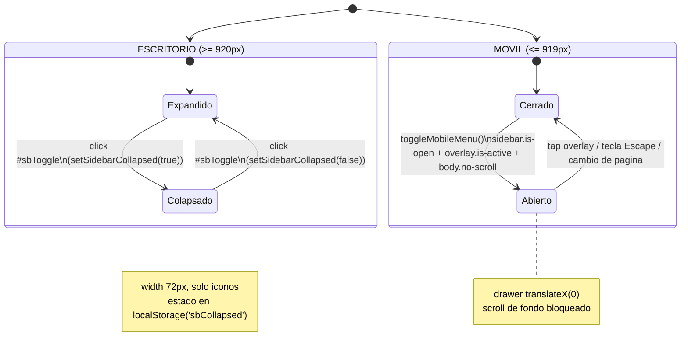

# Diseño Responsive — Unimagdalena en Cifras

> Guía técnica del comportamiento adaptable (responsive) del tablero. Está pensada para un desarrollador nuevo en el proyecto: explica **qué** hace cada regla, **dónde** vive en el código y, sobre todo, **por qué** se tomó cada decisión.

**Fuentes de verdad de esta guía (verificadas línea por línea):**

- `assets/css/tokens.css` — sección 4 "MEDIA QUERIES PARA ADAPTACIÓN MÓVIL" (líneas 1100–1298) y el `:root` con tokens fluidos y safe-areas (líneas 10–63).
- `index.html` — `<header class="mobile-header">`, `#sbOverlay`, `.sidebar` (líneas 15–59).
- `assets/js/app.js` — `openMobileMenu` / `closeMobileMenu` / `toggleMobileMenu` (líneas 52–77), `setSidebarCollapsed` (líneas 651–661), `mountChart` + `ResizeObserver` (líneas 263–279), cableado de eventos (líneas 663–693).

Documentación relacionada:

- [Arquitectura general](./ARQUITECTURA.md)
- [Sistema de estilos y tokens](./ESTILOS.md)
- [Componentes de interfaz](./COMPONENTES.md)
- [Guía del desarrollador](./GUIA_DESARROLLADOR.md)
- [Registro de decisiones (ADR)](./adr/README.md)

---

## 1. Estrategia responsive

### 1.1 La estrategia real es **Desktop-first**

Aunque el título del archivo `tokens.css` habla de "adaptación móvil", la realidad del código es **desktop-first** y conviene documentarla con honestidad:

- Las **reglas base** — todo el `:root` (líneas 10–63) y las secciones 1, 2 y 3 de `tokens.css` (líneas 7–1098) — son la versión de **escritorio**. Es el diseño original ya aprobado y validado.
- La **adaptación móvil** vive completa dentro de media queries `@media (max-width: 919px)` (sección 4, líneas 1100–1298), que **sobre-escriben** puntualmente las reglas de escritorio.

Es decir: el navegador primero aplica el diseño de escritorio y, solo cuando el ancho baja de 920px, entran las reglas que lo "colapsan" a móvil.

### 1.2 Por qué desktop-first (y no mobile-first)

La razón es de negocio, no de moda técnica: **preservar al 100% el diseño de escritorio ya aprobado**. El comentario de cabecera del propio archivo lo dice: *"Preservación 100% Idéntica de Escritorio + Adaptación Móvil"* (`tokens.css`, línea 4).

Con desktop-first:

- El diseño de escritorio queda **intacto**: ninguna media query móvil puede tocarlo por accidente, porque las reglas móviles solo existen dentro de `max-width: 919px`.
- La adaptación móvil se concentra en **un único lugar** (sección 4), fácil de auditar y de revertir.
- Cualquier cambio futuro de escritorio no exige tocar el bloque móvil, y viceversa.

El costo aceptado es que las reglas móviles a veces necesitan `!important` para vencer a la especificidad de las reglas base de escritorio (p. ej. en `.content`, líneas 1136–1140). Es una consecuencia consciente de la estrategia, no un descuido.

### 1.3 Tabla de breakpoints

Solo existe **un breakpoint principal: 919 / 920px**. Los otros dos son refinamientos *dentro* del rango móvil, no breakpoints nuevos.

| Rango | Media query (código) | Rol | Qué cambia |
|---|---|---|---|
| `≥ 920px` | *(sin media query — reglas base)* | **Escritorio** | Diseño original completo: sidebar fijo, `.page-fill` a pantalla completa, filtros en fila, KPIs en columna. |
| `≤ 919px` | `@media (max-width: 919px)` | **Móvil / tablet** (breakpoint principal) | Sidebar → drawer, aparece header móvil, se desactiva `.page-fill`, filtros y vistas se apilan, gráfico a altura fija. |
| `480–919px` | `@media (min-width: 480px) and (max-width: 919px)` | Refinamiento móvil ancho | Botones del hero vuelven a fila (`.ih-actions`); grilla de portada a 2 columnas. |
| `576–919px` | `@media (min-width: 576px) and (max-width: 919px)` | Refinamiento tablet | Tiles del inicio a 3 columnas; KPIs lado a lado; grilla de Metodología a 3 columnas. |

**Por qué 919/920 como frontera única:** simplifica el modelo mental. Por encima es "escritorio con sidebar"; por debajo es "móvil con drawer". Un solo umbral reduce estados intermedios ambiguos y hace predecible el QA.

---

## 2. Sidebar: escritorio vs móvil

El mismo elemento `<aside class="sidebar" id="sidebar">` (`index.html`, línea 28) cumple dos papeles totalmente distintos según el ancho.

### 2.1 Escritorio (`≥ 920px`): panel fijo y colapsable

Reglas base en `tokens.css`, sección 2 (líneas 163–383):

- **Fijo y flotante:** `position: fixed`, anclado con `top/left/bottom: 24px`, ancho `--sidebar-w: 248px` (línea 47), con esquinas redondeadas (`border-radius: 26px`) y sombra. No se desplaza con el scroll.
- **El contenido cede espacio:** `.content` usa `margin-left: 296px` (línea 377) = 248px del sidebar + 24px de aire a cada lado. **No se usa overlap**; el contenido literalmente empieza a la derecha del panel.
- **Colapsable a 72px:** al añadir la clase `.is-collapsed` al `.layout`, el sidebar encoge a `width: 72px` y el contenido reajusta su `margin-left` a `120px` (líneas 348–357). Se ocultan textos (`.sb-title`, `.sb-label`, `.sb-foot`, `.nav__txt`) y los ítems se centran, quedando solo los íconos.
- **Botón de colapso `#sbToggle`:** ícono de "panel" ubicado junto al título (`index.html`, líneas 32–34). Solo existe en escritorio; en móvil se oculta con `display: none !important` (línea 1132–1134).
- **Estado recordado:** `setSidebarCollapsed(on)` (`app.js`, líneas 651–661) alterna la clase y persiste la preferencia en `localStorage` bajo la clave **`sbCollapsed`** (`'1'`/`'0'`). Al cargar, `wireEvents()` lee ese valor y restaura el estado (líneas 677–679). También actualiza `aria-label`/`title` del botón ("Contraer menú" ↔ "Expandir menú").

**Por qué `margin-left` en vez de un layout flex puro:** el sidebar es `position: fixed` (sale del flujo), así que el contenido necesita un margen explícito para no quedar debajo. La transición `margin-left .25s ease` (línea 382) sincroniza el deslizamiento del contenido con el del panel al colapsar.

### 2.2 Móvil (`≤ 919px`): drawer off-canvas

Dentro de `@media (max-width: 919px)` (líneas 1113–1140) el mismo elemento se reconfigura:

- Se re-ancla a pantalla completa vertical (`top: 0; bottom: 0; left: 0`), pierde bordes redondeados y pasa a ancho `min(290px, 86vw)`.
- **Queda oculto fuera de pantalla:** `transform: translateX(-100%)`. Se muestra al añadir la clase `.is-open`, que lo lleva a `translateX(0)` (líneas 1128–1130).
- La transición usa `cubic-bezier(0.4, 0, 0.2, 1)` (curva "standard" de Material) para un deslizamiento natural.
- `.content` pierde su margen: `margin-left: 0 !important; width: 100% !important` (líneas 1136–1140). El `!important` es necesario para vencer el `margin-left: 296px` de la regla base de escritorio.

**Por qué un drawer con `transform` y no cambiar `display`:** `translateX` está **acelerado por GPU** y es animable; `display` no lo es. Además, mantener el nodo en el DOM (solo desplazado) preserva el foco y el estado de scroll interno del menú.

### 2.3 Diagrama de estados del menú



> Nota: los estados "Colapsado" (escritorio) y "Abierto/Cerrado" (móvil) son **mutuamente excluyentes** en la práctica, porque el breakpoint decide cuál de los dos modos está activo. El botón `#sbToggle` desaparece bajo 920px, así que en móvil no se puede "colapsar", solo abrir/cerrar el drawer.

---

## 3. Header móvil, hamburguesa, drawer, overlay y bloqueo de scroll

### 3.1 Piezas del HTML

En `index.html` (líneas 15–25), antes del `.layout`:

```html
<header class="mobile-header">
  <div class="mh-brand">
    <div class="mh-logo"></div>
    <div class="mh-title">UNIMAGDALENA<span>Indicadores por Factor</span></div>
  </div>
  <button class="mb-menu-btn" id="mbMenuBtn" type="button"
          aria-label="Abrir menú de navegación" aria-expanded="false" aria-controls="sidebar">
    <svg><!-- ícono hamburguesa (3 líneas) --></svg>
  </button>
</header>
<div class="sb-overlay" id="sbOverlay" aria-hidden="true"></div>
```

- El header y el overlay **están ocultos en escritorio** por defecto: `.mobile-header, .sb-overlay { display: none !important; }` (líneas 112–114).
- Solo se activan bajo 920px: `.mobile-header { display: flex !important; }` y `.sb-overlay { display: block; }` (líneas 1104–1111).

**Por qué existe una barra superior aparte en móvil:** en escritorio la marca y la navegación viven en el sidebar flotante. Al convertir ese sidebar en un drawer oculto, el usuario necesita un ancla visible permanente (logo + título + botón de menú). La `.mobile-header` es esa barra `position: sticky; top: 0` (líneas 124–126), siempre accesible al hacer scroll.

### 3.2 El flujo de apertura/cierre (JavaScript)

Todo está en `assets/js/app.js`:

| Función | Líneas | Qué hace |
|---|---|---|
| `openMobileMenu()` | 53–61 | `sidebar.classList.add('is-open')` + `sbOverlay.classList.add('is-active')` + `mbMenuBtn[aria-expanded=true]` + `body.classList.add('no-scroll')`. |
| `closeMobileMenu()` | 63–71 | Revierte las tres clases y pone `aria-expanded=false`. |
| `toggleMobileMenu()` | 73–77 | Si el sidebar tiene `is-open`, cierra; si no, abre. |

Cableado en `wireEvents()` (líneas 669–688):

- `#mbMenuBtn` → `onclick = toggleMobileMenu` (línea 671).
- `#sbOverlay` → `onclick = closeMobileMenu` (línea 674): **tocar el fondo oscuro cierra el menú**.
- `Escape` global → cierra modal, panel de factor **y** el menú móvil (línea 688).
- Además, navegar entre páginas llama a `closeMobileMenu()` en el router (línea 35), para que el drawer no quede abierto tras elegir una sección.

### 3.3 Overlay (backdrop) y bloqueo de scroll

- **Backdrop `.sb-overlay`** (líneas 152–158): `position: fixed; inset: 0`, fondo semitransparente `rgba(0,20,40,.5)` con `backdrop-filter: blur(2px)`. Empieza invisible (`opacity: 0; visibility: hidden`) y aparece con la clase `.is-active` mediante transición de opacidad. Vive por debajo del sidebar (`z-index: 44` vs `50` del sidebar) pero por encima del contenido.
- **Bloqueo de scroll `body.no-scroll`** (líneas 86–88): `overflow: hidden !important`. Impide que el contenido de fondo haga scroll mientras el drawer está abierto.

**Por qué bloquear el scroll de fondo:** sin `no-scroll`, al arrastrar sobre el drawer el usuario terminaría desplazando la página de detrás ("scroll chaining"), una experiencia confusa en móvil. Congelar el `body` mantiene el foco en el menú.

> Nota de implementación: `body.no-scroll` también lo usan los modales (`openModal`/`closeModal`, líneas 520/527) y el panel de factor. Es un mecanismo compartido para cualquier capa superpuesta.

---

## 4. Modales (`.fdlg` / `.modal`) en móvil

Los modales (ficha de factor `.fdlg` y modal genérico `.modal`) comparten estilos en `tokens.css` (líneas 994–1031). No tienen una media query dedicada; su adaptabilidad es **intrínseca**, resuelta con unidades relativas:

- **Ancho fluido:** `width: min(780px, 94vw)` (línea 998). En escritorio tope a 780px; en un teléfono angosto ocupa el 94% del viewport, dejando 3% de aire a cada lado.
- **Alto acotado con scroll interno:** `max-height: 88vh; max-height: 88dvh` (línea 998). El cuerpo `.fdlg__body` / `.mb` tiene `overflow-y: auto` (línea 1014), así que **el modal nunca crece más que la pantalla**: su contenido hace scroll dentro, no la página.
- **Overlay con padding:** `.pt-overlay.show, .overlay.show` añade `padding: 16px` (línea 996), garantizando margen mínimo alrededor del modal aun en pantallas pequeñas.
- **Pie que envuelve:** `.fdlg__foot` usa `flex-wrap: wrap` (línea 1027), de modo que la fuente y el botón CTA se apilan si no caben en una línea.

**Por qué `dvh` en el `max-height`:** ver sección 9. En resumen, evita que la barra dinámica del navegador móvil recorte el modal.

**Por qué no hay media query de modal:** al basarse en `min()`, `vw`, `dvh` y `flex-wrap`, el modal ya se adapta de forma continua a cualquier ancho sin necesidad de un breakpoint discreto. Es el enfoque preferido cuando el componente puede expresarse en unidades relativas.

---

## 5. Tablas responsive (scroll horizontal interno)

La tabla de la página **Datos** (`.dz-tbl` dentro de `.dz-table-wrap`) no se refluye ni se colapsa en tarjetas; conserva sus columnas y ofrece **scroll horizontal interno**.

- **Contenedor con scroll:** `.dz-table-wrap` tiene `overflow: auto` y un alto máximo `max-height: calc(100dvh - 300px)` (línea 1057) — scroll vertical con cabecera fija (`thead th { position: sticky; top: 0 }`, línea 1059).
- **Ancho mínimo en móvil:** dentro de `@media (max-width: 919px)`, `.dz-tbl { min-width: 620px }` (líneas 1256–1258). La tabla se niega a encogerse por debajo de 620px; en su lugar, desborda **dentro de su contenedor** y este muestra la barra de scroll horizontal.

**Por qué scroll interno y no reflow:** son datos numéricos comparables por año (serie 2020–2025). Apilar cada fila como tarjeta rompería la lectura columna-a-columna. El scroll interno preserva la comparación tabular **y** evita que la *página* haga scroll horizontal —el `body` mantiene `overflow-x: hidden` (línea 73), así que solo el contenedor de la tabla se desplaza, nunca el layout completo.

---

## 6. Gráficos SVG responsive

El gráfico de la página **Factores** es SVG generado en JS, y es responsive por dos mecanismos combinados.

### 6.1 SVG fluido con `viewBox`

Los constructores de SVG (`buildLineSVG`, `buildBarSVG`, sparklines) emiten `width="100%"` + un `viewBox` calculado y `preserveAspectRatio` (`app.js`, líneas 106, 131, 336, 372). El `viewBox` desacopla el sistema de coordenadas del tamaño de render: el SVG escala al ancho del contenedor sin deformarse.

- `.chart-host svg { width: 100%; height: 100%; display: block }` (líneas 812–816) hace que el SVG llene el hueco disponible.

### 6.2 Redibujo real con `ResizeObserver`

Escalar con `viewBox` estira el dibujo, pero **no** recalcula densidad de etiquetas ni grosores. Para eso, `mountChart` (`app.js`, líneas 266–279) instala un `ResizeObserver` sobre el `.chart-host`:

```js
chartRO = new ResizeObserver(draw);
chartRO.observe(host);
```

Cada vez que el host cambia de tamaño, `draw()` **regenera** el SVG con el nuevo `w`/`h` (`host.clientWidth/clientHeight`). Así el gráfico se redibuja a la resolución exacta —por ejemplo, `chartFrame` reduce el tamaño de fuente de los ejes a `10px` cuando `w < 420` (línea 286).

### 6.3 Altura: flexible en escritorio, fija en móvil

- **Escritorio:** `.chart-host` **no** lleva altura en px; usa `height: 100%` (línea 807) y se estira dentro del `.fx-chart` flex, que a su vez llena la pantalla vía `.page-fill`. La altura la determina el layout, y el `ResizeObserver` la traduce al SVG.
- **Móvil:** al desactivarse `.page-fill` (ver sección siguiente), ya no hay una altura "de pantalla" que heredar, así que se fija explícitamente: `.chart-host { flex: none; height: 300px; min-height: 300px }` (línea 1230).

**Por qué altura fija solo en móvil:** en escritorio el objetivo es "llenar la pantalla sin scroll", y el gráfico se estira para ocupar el espacio sobrante. En móvil ese modelo se abandona en favor del scroll vertical natural; sin una altura explícita, un contenedor flex sin altura definida colapsaría a 0. Los 300px garantizan un gráfico legible antes de continuar el scroll.

### 6.4 `.page-fill` — el modo "llenar la pantalla" y su desactivación

Las páginas Factores y Metodología usan `.page-fill` para ocupar exactamente el alto visible sin provocar scroll:

- **Escritorio:** `.page-fill.is-active { display: flex; flex-direction: column; height: calc(100dvh - var(--content-pad-y)) }` (línea 977). El contenido se reparte con flex y nada desborda.
- **Móvil:** se **desactiva** por completo dentro de `@media (max-width: 919px)`:

```css
.page-fill.is-active { height: auto !important; display: block !important; }
.page-fill.is-active #content { display: block; }
```
(líneas 1225–1229)

**Por qué desactivarlo en móvil:** forzar todo a una sola pantalla en un teléfono comprimiría gráfico, filtros y KPIs hasta hacerlos ilegibles. En móvil se prefiere el scroll vertical natural: `height: auto` + `display: block` devuelven el flujo normal del documento.

---

## 7. Tipografía fluida y `clamp()`

La escala fluida evita saltos bruscos entre breakpoints: el texto y los espacios **interpolan de forma continua** con el tamaño del viewport, con topes mínimo y máximo.

### 7.1 Tokens fluidos (definidos en `:root`)

| Token | Fórmula (`tokens.css`) | Unidad de interpolación | Propósito |
|---|---|---|---|
| `--fluid-gap` | `clamp(18px, 2.4vh, 28px)` (línea 54) | `vh` (alto) | Aire entre gráfico y KPIs / tarjetas. |
| `--fluid-card-pad` | `clamp(8px, 1.4vh, 18px)` (línea 55) | `vh` (alto) | Padding interior de tarjetas. |
| `--fluid-kpi-value` | `clamp(1.35rem, 3.2vh, 2rem)` (línea 56) | `vh` (alto) | Número grande del KPI (máx. 32px). |

**Por qué interpolar con `vh` (altura) y no `vw`:** estos tokens sirven al modo "llenar la pantalla" (`.page-fill`), donde el factor crítico es el **alto** disponible. Si la ventana es baja, se reducen paddings y el número del KPI para que todo quepa sin scroll; si es alta, crecen hasta su tope. Ligarlos al ancho no respondería a ese problema.

### 7.2 `clamp()` con `vw` puntuales

Otros textos interpolan con el **ancho** (`vw`) porque su legibilidad depende del ancho de columna:

- `.ih-title` (hero de Inicio) en móvil: `font-size: clamp(2rem, 7vw, 42px)` (línea 1150).
- `.pt-hero__title` (portada Metodología): `clamp(1.9rem, 3.4vh, 2.5rem)` (línea 952), y sus párrafos/gaps con `clamp(...vh...)` (líneas 954–955).

**Cómo leer un `clamp(min, preferido, max)`:** el navegador usa `preferido` (el término con `vh`/`vw`) mientras esté entre `min` y `max`; fuera de ese rango se ancla al límite. Resultado: **cero media queries** para tipografía —una sola declaración cubre todos los tamaños de pantalla de forma continua.

---

## 8. Safe areas (`env()`) y `viewport-fit=cover`

Para respetar el notch, la barra de gestos y las esquinas redondeadas de móviles modernos (iPhone en particular):

### 8.1 El meta viewport

En `index.html`, línea 5:

```html
<meta name="viewport" content="width=device-width, initial-scale=1.0, viewport-fit=cover">
```

`viewport-fit=cover` hace que la página use **toda** la pantalla, incluidas las zonas bajo el notch. Sin él, `env(safe-area-inset-*)` siempre valdría 0 y no habría nada que compensar.

### 8.2 Tokens de safe-area

En `:root` (`tokens.css`, líneas 58–62):

```css
--sat: env(safe-area-inset-top, 0px);
--sab: env(safe-area-inset-bottom, 0px);
--sal: env(safe-area-inset-left, 0px);
--sar: env(safe-area-inset-right, 0px);
```

El segundo argumento (`0px`) es el fallback en dispositivos sin áreas seguras, por lo que en escritorio no producen ningún efecto.

### 8.3 Dónde se aplican

- **Header móvil:** `padding: calc(9px + var(--sat)) max(14px, var(--sar)) 9px max(14px, var(--sal))` (línea 121) — baja el contenido por debajo del notch y respeta los bordes.
- **Drawer:** `padding: calc(20px + var(--sat)) max(18px, var(--sar)) calc(20px + var(--sab)) max(18px, var(--sal))` (línea 1123) — evita que la marca choque con el notch y que el pie quede bajo la barra de gestos.
- **Contenido en móvil:** `padding: 18px max(14px, var(--sar)) 40px max(14px, var(--sal)) !important` (línea 1138) — el patrón `max(14px, var(--sa*))` asegura **al menos** 14px, y más si el dispositivo lo exige.

**Por qué el patrón `max(base, env(...))`:** garantiza un padding mínimo cómodo en cualquier equipo y lo amplía solo cuando el hardware (notch, esquinas) lo necesita. Es la forma robusta de combinar diseño y seguridad de área.

---

## 9. Unidades de viewport: `dvh`, `svh`, `lvh`

En móvil la barra de direcciones del navegador aparece y desaparece con el scroll, cambiando el alto visible real. Las unidades de viewport dinámicas resuelven esto:

| Unidad | Significado | Comportamiento |
|---|---|---|
| `svh` | *small viewport height* | Alto **mínimo** garantizado (barra del navegador **visible**). |
| `lvh` | *large viewport height* | Alto **máximo** (barra del navegador **oculta**). |
| `dvh` | *dynamic viewport height* | Se **ajusta en vivo** entre `svh` y `lvh` según el estado de la barra. |
| `vh` | *viewport height* (clásico) | Fijo; en muchos móviles equivale a `lvh`, por lo que **sobrestima** el alto cuando la barra está visible. |

### 9.1 Uso en el proyecto (con fallback)

El patrón es siempre **declarar `vh` primero y `dvh` después**, para que los navegadores sin soporte de `dvh` usen `vh` y los modernos apliquen `dvh`:

```css
.page-fill.is-active { height: calc(100vh - var(--content-pad-y));
                       height: calc(100dvh - var(--content-pad-y)); }   /* línea 977 */
```

También en `.portada` (líneas 919–920), `.doc--fill` (línea 987), `.dz-table-wrap` (línea 1057) y el `max-height` de los modales (línea 998).

**Por qué se prefiere `dvh`:** el modo "llenar la pantalla" (`.page-fill`) exige medir el alto **realmente** visible. Con `100vh` clásico, en cuanto la barra del navegador se muestra, el contenido mediría de más y aparecería un molesto salto/scroll. `100dvh` se adapta en vivo y elimina ese salto. Se mantiene la línea `vh` previa como red de seguridad para navegadores antiguos (la última declaración válida gana). `svh`/`lvh` se documentan como contexto conceptual; el código usa `dvh`.

---

## 10. Accesibilidad responsive

### 10.1 Reducción de movimiento

`@media (prefers-reduced-motion: reduce)` (líneas 1291–1298):

```css
html { scroll-behavior: auto; }
*, *::before, *::after {
  transition-duration: 0.01ms !important;
  animation-duration: 0.01ms !important;
}
```

**Por qué:** usuarios sensibles al movimiento (vértigo, mareo) pueden pedir al sistema "reducir movimiento". Esta regla neutraliza transiciones y el desplazamiento suave, respetando esa preferencia sin romper el layout.

### 10.2 Áreas táctiles ≥ 44px

El mínimo recomendado de 44px de alto para objetivos táctiles se respeta en los controles clave:

- `.nav__item { min-height: 44px }` (línea 275).
- Botón hamburguesa `.mb-menu-btn`: 42×42px con padding efectivo (líneas 143–147).
- Dropdowns en móvil: `.dd__btn { min-height: 44px }` (líneas 1202–1205); en la página Datos, `.dz-dd .dd__btn { height: 44px }` (línea 1054).

**Por qué:** en pantallas táctiles un objetivo menor a ~44px es difícil de acertar con el dedo y genera errores. Ampliar los controles en móvil mejora precisión y accesibilidad motriz.

### 10.3 Foco visible y `touch-action`

- **Foco visible:** `:focus-visible { outline: 2px solid var(--brand-accent); outline-offset: 2px }` (líneas 106–109) — contorno claro para navegación por teclado, sin ensuciar la interacción con ratón.
- **`touch-action: manipulation`** en `button, a, input, select` (líneas 102–104) — desactiva el retardo de ~300ms del doble-tap-zoom, haciendo los toques más inmediatos.
- **Semántica ARIA sincronizada:** el botón hamburguesa mantiene `aria-expanded` en sincronía con el estado del drawer (`app.js`, líneas 59 y 69), y `aria-controls="sidebar"` lo asocia al panel que controla.

**Por qué importa en responsive:** el modo móvil introduce controles que no existen en escritorio (hamburguesa, drawer). Cablear su estado ARIA y garantizar tamaño táctil y foco visible asegura que la versión móvil sea igual de accesible que la de escritorio.

---

## Resumen para el desarrollador nuevo

1. **Todo lo móvil está en la sección 4 de `tokens.css`** (`@media (max-width: 919px)`). Si un cambio no debe afectar escritorio, va ahí.
2. **Un solo breakpoint real: 920px.** Los rangos 480–919 y 576–919 solo afinan columnas dentro de móvil.
3. **El sidebar es un componente con doble personalidad:** panel fijo colapsable (escritorio, estado en `localStorage`) o drawer con overlay y `body.no-scroll` (móvil). La lógica está en `app.js`.
4. **`dvh`, `clamp()`, `env()` y `ResizeObserver`** son las cuatro herramientas que hacen el layout continuo y sin saltos; entiéndelas antes de tocar alturas o tipografía.
